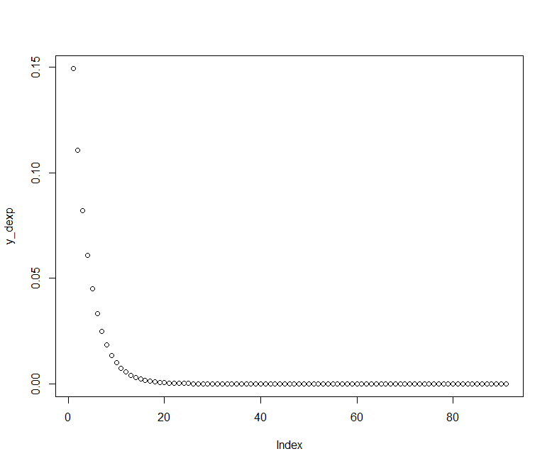

# Praktikum Probabilitas Statistik Modul 1
**<br>Dimas Fadilah Akbar_5025211010**
**<br>Kelas Probstat A**

## Requirement
- R for windows
- RStudio

## Instalasi Library 
- library Rlab
- library dplyr
- library ggplot
> pada praktikum ini akan menggunakan fungsi-fungsi yang tersedia pada library Rlab, dplyr, dan ggplot. Untuk itu perlu melakukan instalasi dengan mengetikkan code berikut pada console di RStudio
```
install.packages("Rlab")
install.packages("dplyr")
install.packages("ggplot2")
```

## Soal 1 (Distribusi Geometrik)

### a) Berapa peluang penyurvei bertemu x = 3 orang yang tidak menghadiri acara vaksinasi  sebelum keberhasilan pertama ketika p = 0,20 dari populasi menghadiri acara vaksinasi ?
dalam menyelesaikan soal tersebut dapat menggunakan fungsi dgeom khusus untuk distribusi geometrik
```
n = 3
p = 0.20
output = dgeom(x = n, prob = p)
print(output)
```

output:
```
0.1024
```

### b) mean Distribusi Geometrik dengan 10000 data random , prob = 0,20 dimana distribusi geometrik acak tersebut X = 3?
- dalam menentukan distribusi geometriknya dapat menggunakan fungsi rgeom 
- dalam menentukan mean dari distribusi geometrik dapat menggunakan fungsi mean

code :
```
rand <- 10000
p <- 0.20
m = mean(rgeom(n = rand, prob = p) == 3)
print(m)
```

output pada percobaan pertama: 
```
0.0997
```

output pada percobaan kedua:
```
0.1036
```

### c) Bandingkan Hasil poin a dan b , apa kesimpulan yang bisa didapatkan?
> pada subsoal a didapatkan nilai yang konstan dan tidak berubah sedangkan pada subsoal b didapatkan nilai yang berubah-ubah. Hal tersebut menunjukkan bahwa distribusi geometrik pada a sama dan distribusi geometrik pada b acak

### d) Histogram Distribusi Geometrik , Peluang X = 3 gagal Sebelum Sukses Pertama
code:
Berikut merupakan generate berdasarkan peluangnya dengan menggunakan fungsi dgeom
```
library(ggplot2)
library(dplyr)

data.frame(x = 0:5, prob = dgeom(x = 0:5, prob = p)) %>%
  mutate(Failures = ifelse(x == n, n, "other")) %>%
  ggplot(aes(x = factor(x), y = prob, fill = Failures)) +
  geom_col() +
  geom_text(
    aes(label = round(prob,2), y = prob + 0.01),
    position = position_dodge(0.9),
    size = 3,
    vjust = 0
  ) +
  labs(title = "Probabilitas dari x = 3 gagal sebelum sukses pertama",
       subtitle = "Distribusi Geometrik",
       x = "Kegagalan sebelum sukses pertama (x)",
       y = "Peluang") 
```
output:


code :
Berikut merupakan generate dengan distribusi acak menggunakan fungsi rgeom
```
x <- rgeom(1000, 0.20)
hist(x, main = "Histogram Geometrik Distribution", labels = T, col = "lightgreen")
```

output:


### e) Nilai Rataan (μ) dan Varian (σ²) dari Distribusi Geometrik.
- formula dalam menentukan rataan di distribusi geometrik adalah (1/p).
- formula dalam menentuka varian di distribusi geomtrik adalah (1-p)/p^2

code: 
```
p <- 0.20
rataan = (1/p)
varian = ((1-p)/p^2)
print(paste("rataan: ", as.character(rataan)))
print(paste("varian: ", as.character(varian)))
```
output:
```
"rataan: 5"
"varian: 20"
```

## Soal 2 (Distribusi Binomial)
### Terdapat 20 pasien menderita Covid19 dengan peluang sembuh sebesar 0.2. Tentukan :

### a) Peluang terdapat 4 pasien yang sembuh.
Dalam menentukan peluang pada distribusi binomial dapat menggunakan fungsi dbinom dengan 3 parameter yaitu:
- x menyatakan sukses
- p sebagai peluang sukses
- n sebagai total partisipan.

code:
```
n = 20
p = 0.2
x = 4
print(paste("Peluang 4 pasien sembuh: ", as.character(dbinom(x, n, p))))
```
output:
```
"Peluang 4 pasien sembuh:  0.218199401946101"
```

### b) Gambarkan grafik histogram berdasarkan kasus tersebut.
> menentukan distribusi binomial dalam bentuk grafik histogram 

code :
menentukan peluangnya dan visualisasi dengan plot untuk x dari 0 hingga 20
```
n <- 20
p <- 0.2
x <- array(0:20)
plot(x, dbinom(x, n, p),
     type="h",
     main="Distribusi Binomial",
     ylab = "Probabilitas"
     )
```

output:


code :
histogram dengan random nilai 20 dan peluang 0.20
```
n <- 20
size <- 20
p <- 0.20
x <- rbinom(n, size, p)
hist(x, main = "Histogram Binomial Distribution", labels = T, col = "lightgreen")
```

output:


### c) Nilai Rataan (μ) dan Varian (σ²) dari Distribusi Binomial.
- rataan (μ) pada distribusi binomial dapat dicari dengan rumus n*p
- varian (σ²) pada distribusi binomial dapat dicari dengan rumus n*p*(1-p)

code :
```
n <- 20
p <- 0.2
rataan = n*p
varian = n*p*(1-p)
print(paste("rataan distribusi binomial(µ): ", rataan))
print(paste("varian distribusi binomial(s²): ", varian))
```

output:
```
"rataan distribusi binomial(µ):  4"
"varian distribusi binomial(s²):  3.2"
```

## Soal 3 (Distribusi Poisson)
### Diketahui data dari  sebuah tempat bersalin di rumah sakit tertentu menunjukkan rata-rata historis 4,5 bayi lahir di rumah sakit ini setiap hari. (gunakan Distribusi Poisson)

### a) Berapa peluang bahwa 6 bayi akan lahir di rumah sakit ini besok?
Dalam menentukan peluang pada distribusi poisson dapat menggunakan fungsi dpois dengan dua parameter yaitu:
- x => menyatakan banyaknya sukses yang terjadi
- lambda => menyatakan rata-rata banyaknya sukses yang terjadi pada interval waktu atau daerah tertentu

code :
```
x <- 6
lambda <- 4.5
peluang = dpois(x, lambda)
print(paste("probabilitas distribusi poisson 6 bayi lahir: ", peluang))
```

output:
```
"probabilitas distribusi poisson 6 bayi lahir:  0.128120143864584"
```

### b) simulasikan dan buatlah histogram kelahiran 6 bayi akan lahir di rumah sakit ini  selama setahun (n = 365)
dalam menentukan frekuensi banyaknya bayi yang lahir dalam jangka waktu 365 hari kita dapat menggunakan fungsi rpois dengan dua parameter:
- n => inverval waktu atau daerah
- lambda => rata-rata banyaknya sukses pada interval waktu atau daerah tertentu

code :
```
set.seed(2)
n <-365
lambda <- 4.5
x <- rpois(n, lambda)
hist(x,main="Histogram Poisson Distribution",labels=T, col = "orange")
```

output:


### c) dan bandingkan hasil poin a dan b , Apa kesimpulan yang bisa didapatkan
> apabila peluang yang didapatkan pada point a dikalikan dengan interval waktunya yaitu 365 maka akan didapatkan hasil yang hampir sama. Yang artinya peluang lahirnya bayi pada interval waktu 365 hari tidak jauh dari peluang distribusi poissonnya dalam pada interval satu hari.

### d) Nilai Rataan (μ) dan Varian (σ²) dari Distribusi Poisson.
- rataan (μ) pada distribusi poisson merupakan lambda
- varian (σ²) pada distribusi poisson juga merupakan lambda

code :
```
lambda <- 4.5
rataan = lambda
varian = lambda
print(paste("rataan distribusi poisson: ", rataan))
print(paste("varian distribusi poisson: ", varian))
```

output:
```
"rataan distribusi poisson:  4.5"
"varian distribusi poisson:  4.5"
```

## Soal 4 (Distribusi Chi-Square)
### Diketahui nilai x = 2 dan v = 10. Tentukan:

### a) Fungsi Probabilitas dari Distribusi Chi-Square.
Dalam menentukan probabilitas dari distribusi chi-square kita dapat menggunakan fungsi dchisq dengan dua parameter yaitu:
- x => variable peubah acak kontinu
- v => derajat bebas

code :
```
x <- 2
v <- 10
print(paste("probabilitas distribusi chi-square: ", dchisq(x, v)))
```

output :
```
"probabilitas distribusi chi-square:  0.00766415502440505"
```

### b) Histogram dari Distribusi Chi-Square dengan 100 data random
code :
```
set.seed(2)
n <- 100
v <- 10
x <- rchisq(n, v)
hist(x, main="Histogram Chi-Square Distribution", labels = T, col = "orange")
```

output :


### c) Nilai Rataan (μ) dan Varian (σ²) dari Distribusi Chi-Square.
- rataan (μ) pada distribusi chi-square dapat dicari dengan nilai v
- varian (σ²) pada distribusi chi-square dapat dicari dengan rumus 2v

code :
```
rataan = v
varian = 2*v
print(paste("rataan distribusi chi-squre: ", rataan))
print(paste("varian distribusi chi-square: ", varian))
```

output :
```
"rataan distribusi chi-squre:  10"
"varian distribusi chi-square:  20"
```

## Soal 5 (Distribusi Eksponensial)
### Diketahui bilangan acak (random variable) berdistribusi exponential (λ = 3). Tentukan

### a) Fungsi Probabilitas dari Distribusi Exponensial 
Dalam menentukan probabilitas dari distribusi eksponensial kita dapat menggunakan fungsi dexp dengan 2 parameter:
- x => menyatakan x-values untuk exp function
- rate => represents the shapex.

code :
Pada soal hanya diketahui rate nya saja yaitu 3 sehingga kita perlu membuat vector dari x nya yaitu dari 1 hingga 10 dengan kenaikan nilai sebanyak 0.1
```
rate <- 3
x_dexp = seq(1, 10, by = 0.1)
y_dexp = dexp(x_dexp, rate)
plot(y_dexp)
```

output :



### b) Histogram dari Distribusi Exponensial untuk 10, 100, 1000 dan 10000 bilangan random
Dalam membuat distribusi eksponensial untuk bilangan jumlah bil random yang telah ditentukan kita dapat menggunakan fungsi rexp dengan dua parameter:
- n => banyak bilangan random
- rate => represents the shapex

code :
```
rate <- 3
n1 <- 10
n2 <- 100
n3 <- 1000
n4 <- 10000
x1 = rexp(n1, rate)
x2 = rexp(n2, rate)
x3 = rexp(n3, rate)
x4 = rexp(n4, rate)
hist(x1, main = "Histogram Chi-Square Distribution for n = 10", labels = T, col = "lightblue")
hist(x2, main = "Histogram Chi-Square Distribution for n = 100", labels = T, col = "lightblue")
hist(x3, main = "Histogram Chi-Square Distribution for n = 1000", labels = T, col = "lightblue")
hist(x4, main = "Histogram Chi-Square Distribution for n = 10000", labels = T, col = "lightblue")
```

output:


### c) Nilai Rataan (μ) dan Varian (σ²) dari Distribusi Exponensial untuk n = 100 dan λ = 3
Petunjuk: 
- Gunakan set.seed(1)
- Gunakan fungsi bawaan R

code :
```
n <- 100
rate <- 3
set.seed(1)
rataan = mean(rexp(n, rate))
varian = sd(rexp(n, rate)) ^ 2
print(paste("Rataan distribusi eksponensial: ", rataan))
print(paste("Varian distribusi eksponensial: ", varian))
```

output:
```
"Rataan distribusi eksponensial:  0.343558812019206"
"Varian distribusi eksponensial:  0.0656076521452312"
```

## Soal 6 (Distribusi Normal)
### Diketahui generate random nilai sebanyak 100 data, mean = 50, sd = 8. Tentukan

### a) Fungsi Probabilitas dari Distribusi Normal P(X1 ≤ x ≤ X2), hitung Z-Score Nya dan plot data generate randomnya dalam bentuk grafik. Petunjuk(gunakan fungsi plot()).
Keterangan : 
- X1 = Dibawah rata-rata 
- X2 = Diatas rata-rata
Contoh data :
- 1,2,4,2,6,3,10,11,5,3,6,8
- rata-rata = 5.083333
- X1 = 5
- X2 = 6

code :
```
n <- 100
rataan <- 50
sd <- 8
data_mean = mean(rnorm(n, rataan, sd))
data = rnorm(n, rataan, sd)
x1 = floor(data_mean)
x2 = ceiling(data_mean)

z_scores = (data - data_mean) / sd(data)

plot(z_scores, type = 'o', col = "darkmagenta")
```

output :


### b) Generate Histogram dari Distribusi Normal dengan breaks 50 dan format penamaan: 
- NRP_Nama_Probstat_{Nama Kelas}_DNhistogram
Contoh :
- 312312312_Rola_Probstat_A_DNhistogram

code :
```
n <- 100
rataan <- 50
sd <- 8
x <- rnorm(n,rataan,sd)
hist(x,
     breaks = 50,
     main = "5025211010_Dimas Fadilah Akbar_Probstat_A_DNhistogram", col = "darkmagenta", labels = T)
```

output:


### c) Nilai Varian (σ²) dari hasil generate random nilai Distribusi Normal.

code :
```
n <- 100
rataan <- 50
sd <- 8
varian = var(rnorm(n, rataan, sd))

print(varian)
```

output:
percobaan pertama
```
62.93885
```
percobaan kedua
```
68.46113
```
